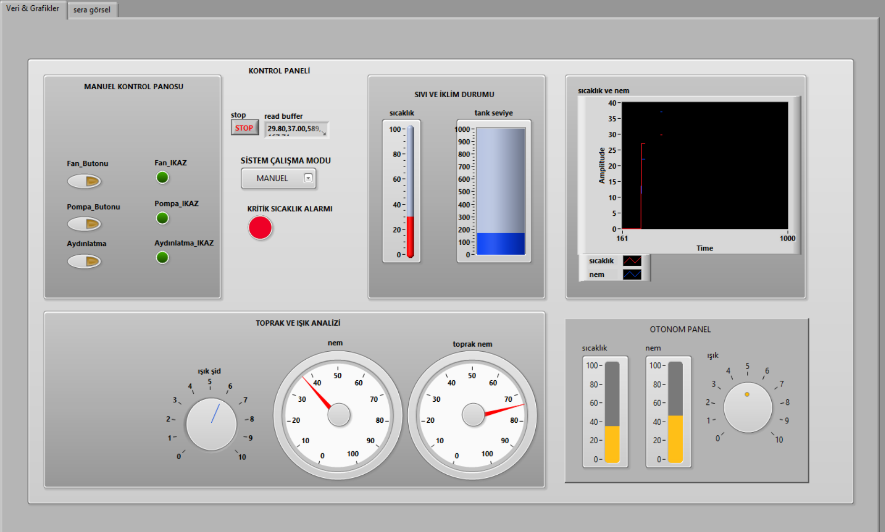
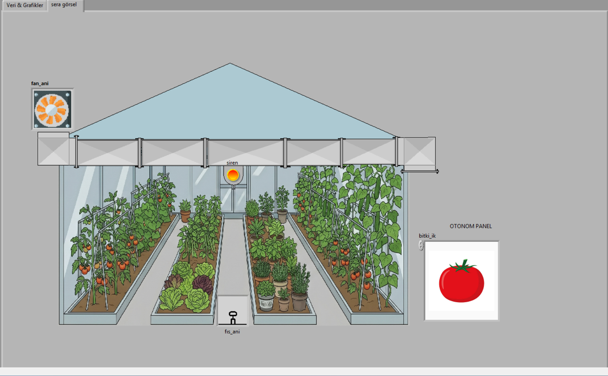
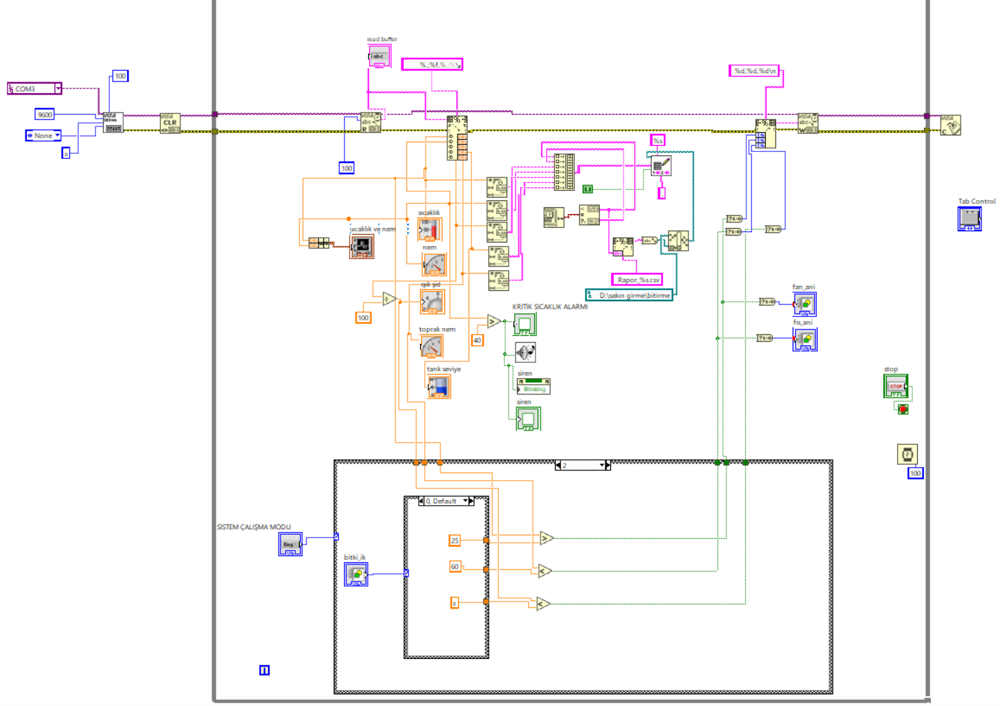
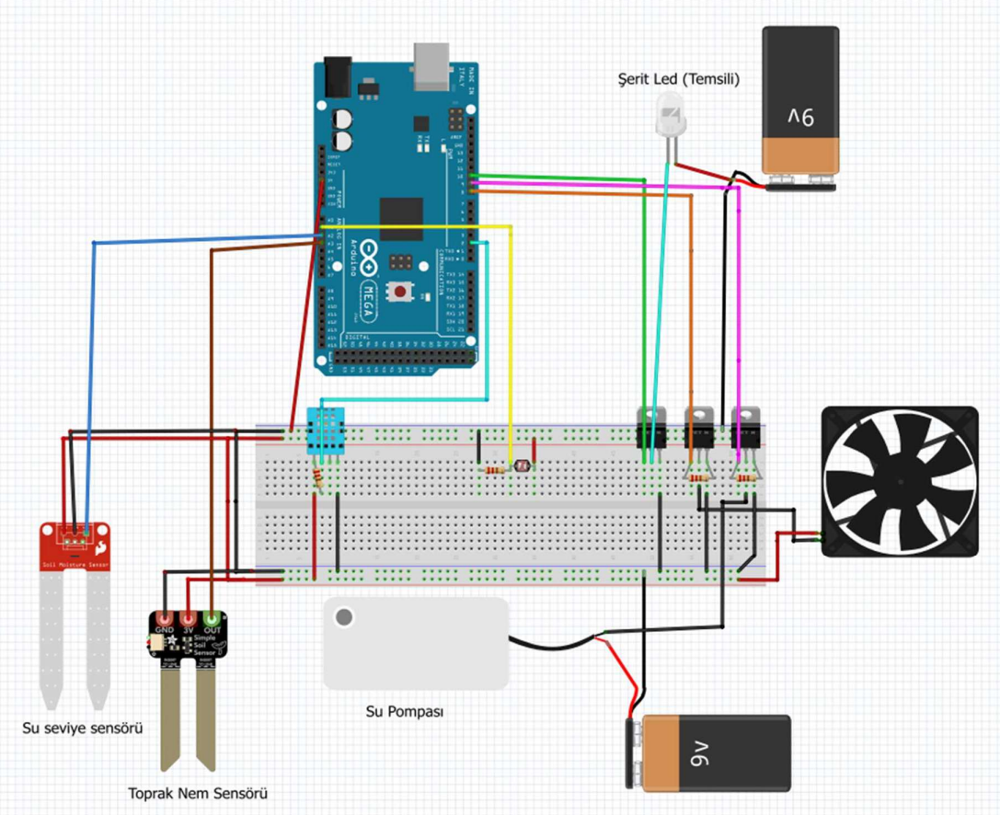

# Smart Greenhouse Automation System 

##  Proje Hakkında
Bu proje, çevre koşullarını optimize etmek amacıyla tasarlanmış otonom bir akıllı sera sistemidir. Sensörlerden alınan çevresel veriler (sıcaklık, nem, ışık vb.) Arduino aracılığıyla toplanır ve **LabVIEW 2026 Community Edition** kullanılarak geliştirilen kullanıcı arayüzünde gerçek zamanlı olarak izlenip kontrol edilir.

##  Donanım Mimarisi ve Sensörler
Sistem aşağıdaki donanım bileşenlerinden oluşmaktadır:
* **Mikrodenetleyici:** Arduino [Uno / Mega vb. modelini yaz]
* **Sıcaklık ve Nem Sensörü:** [Örn: DHT11 veya DHT22]
* **Işık Sensörü:** [Örn: LDR Modülü]
* **Toprak Nem Sensörü:** [Kullandıysan modelini yaz]
* **Eyleyiciler (Aktüatörler):** [Örn: Fan, Su pompası için Röle Modülü]

##  Yazılım ve Haberleşme Protokolü
* **Arayüz ve Kontrol:** LabVIEW 2026 Community Edition
* **Donanım Programlama:** Arduino IDE (C/C++)
* **İletişim Protokolü:** UART / Seri Haberleşme (LabVIEW VISA Modülü)

Arduino, sensörlerden okuduğu ham verileri belirli bir paket yapısında (Örn: `Sicaklik,Nem,Isik\n`) seri port üzerinden bilgisayara iletir. LabVIEW'daki blok diyagramı bu string verisini ayrıştırır (parse) ve ön panelde (Front Panel) grafiksel göstergelere dönüştürür. Gerekli durumlarda eşik değerleri aşıldığında LabVIEW, Arduino'ya kontrol komutları göndererek fan veya su pompasını tetikler.

##  Sistem Görselleri ve Şemalar

### LabVIEW Ön Panel (Front Panel)
Kullanıcıların sensör verilerini canlı olarak izleyebildiği ve sistemi manuel/otomatik modda kontrol edebildiği grafiksel arayüz.

Kullanıcıların su pompası , fan ve ve siren animasyonlarını izlenmesine olanak tanıyan ayrıca reçete mod ayarları yapılabilen panel.

### LabVIEW Blok Diyagramı (Block Diagram)
Sistemin arka planında çalışan, veri işleme ve kontrol algoritmasını içeren düğüm (node) mimarisi.

### Devre Şeması
Sensörlerin ve eyleyicilerin Arduino ile olan pin bağlantılarını gösteren şema.

